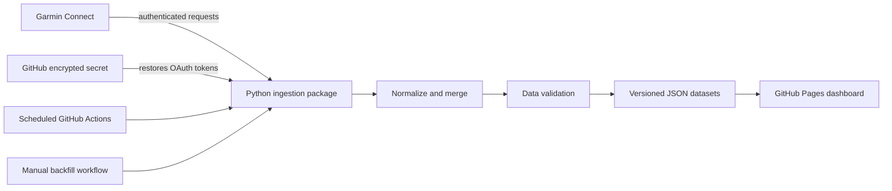

# Garmin Field Log

[](https://torinchacko.github.io/garmin-dashboard/)
[](https://github.com/TorinChacko/garmin-dashboard/actions/workflows/sanity-check.yml)
[](https://www.python.org/)

An automated fitness analytics pipeline that turns Garmin Connect data into a
fast, serverless dashboard. Python fetches and validates the data, GitHub Actions
runs the pipeline on a schedule, and GitHub Pages serves the visualization—no
dedicated server required.

**[Open the live dashboard →](https://torinchacko.github.io/garmin-dashboard/)**

The current dataset contains more than 1,800 daily summaries across five years
and over 90 detailed activities.

## Why I built it

Garmin presents useful daily metrics, but it is difficult to explore several
years of health and training history together. I built Garmin Field Log to own
the complete data path: authenticated ingestion, resumable historical backfill,
normalization, data-quality checks, automated deployment, and interactive
time-series visualization.

## Engineering highlights

- Scheduled, incremental ingestion with a five-day self-healing window
- Resumable multi-year backfills that preserve progress when rate limited
- Idempotent activity upserts keyed by Garmin activity ID
- Defensive normalization of partial and inconsistent API responses
- Validation gates that reject malformed, future, empty, or destructive updates
- MFA-compatible local login and one-command GitHub secret renewal
- Mirrored source and GitHub Pages datasets with deterministic JSON ordering
- Unit tests, linting, encoding checks, and CI on every push and pull request

## Architecture



The daily workflow requests recent summaries and activities, merges them into
stable JSON objects, validates the proposed changes, and publishes the updated
data. The separate backfill workflow pages through older history and can be
safely rerun after interruption or rate limiting.

## Technology

- **Python 3.12:** ingestion, transformation, validation, and token tooling
- **garminconnect / curl-cffi:** Garmin Connect client and HTTP transport
- **pytest / Ruff:** automated testing and static analysis
- **GitHub Actions:** scheduled ingestion, backfills, and CI
- **GitHub Pages:** serverless static hosting
- **Vanilla JavaScript, HTML, and CSS:** responsive interactive dashboard

## Repository layout

```text
src/garmin_dashboard/       reusable auth, transformation, and storage modules
scripts/                    daily ingestion, backfill, validation, encoding checks
tests/                      unit tests for token safety and data normalization
data/                       canonical daily and activity JSON
docs/                       GitHub Pages dashboard and mirrored data
.github/workflows/          CI, scheduled ingestion, and manual backfill jobs
login_once.py               interactive local Garmin login
pack_token.py               GitHub Secret encoder
renew_token.cmd             one-command Windows token renewal
```

## Local development

Requirements: Python 3.12 or newer.

```powershell
git clone https://github.com/TorinChacko/garmin-dashboard.git
cd garmin-dashboard
python -m venv .venv
.venv\Scripts\activate
pip install -e ".[dev]"
pytest
ruff check .
```

To preview the dashboard locally:

```powershell
python -m http.server 8000 --directory docs
```

Then open `http://localhost:8000`.

## Garmin authentication setup

Garmin authentication is performed locally so the account password is never
stored in the repository or GitHub Actions.

```powershell
python login_once.py
python pack_token.py
```

Create a GitHub Actions repository secret named `GARMIN_TOKENS_B64` using the
contents of `garmin_tokens_b64.txt`. Both the token directory and encoded file
are ignored by Git. Delete the encoded file after confirming the workflow works.

On Windows, expired tokens can be renewed and printed for manual pasting with:

```powershell
.\renew_token.cmd
```

If GitHub CLI is installed and authenticated, update the secret automatically
without printing its value:

```powershell
.\renew_token.cmd -Upload
```

## Data-quality safeguards

Before an automated update is committed, the validator confirms that:

- source and deployed datasets are identical;
- dates and metric ranges are valid;
- populated records are not replaced with empty responses;
- historical days and activities are not silently removed; and
- Garmin has not returned a future-dated record.

These checks protect the dashboard from transient API responses and accidental
destructive updates.

## Privacy and security

This deployment intentionally visualizes personal fitness data. Anyone adapting
the project should decide which metrics are appropriate to publish. OAuth token
files, encoded secrets, passwords, and MFA codes must never be committed.

Garmin Field Log is a personal project and is not affiliated with or endorsed by
Garmin.

## License

The source code is available under the [MIT License](LICENSE). Personal data in
the repository is not granted for reuse.
